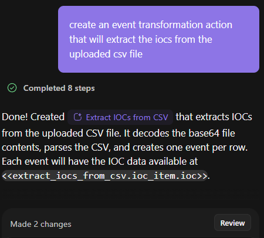
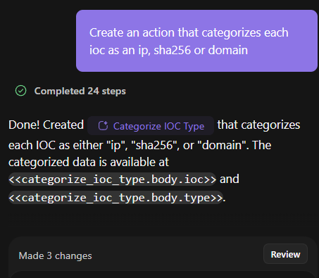

# Tines Story Copilot AI Builder
Tines released their new AI builder feature, [Story Copilot](https://www.tines.com/blog/introducing-story-copilot-a-new-build-tool/). 

I gave the new feature a quick test. 

The new feature has an Ask and a Build mode.

My instance of Story Copilot used Anthropic Claude Sonnet 4.5.

In less than 10 minutes, using three prompts, I was able to build a Tines Page webform where a security analytst can upload a csv of IOCs and have them categorized by the Tines workflow.

Prompt 1:

Prompt 2:

Prompt 3: 

I tested the Tines Page by submitting a text file with IOCs.

The workflow did categorize them correctly:

Give Tines Story Copilot a try since it does not cost any AI credits until April 16th.

Happy Building! or more like happy prompting...
